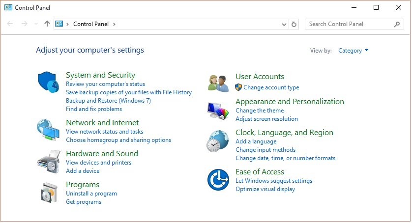
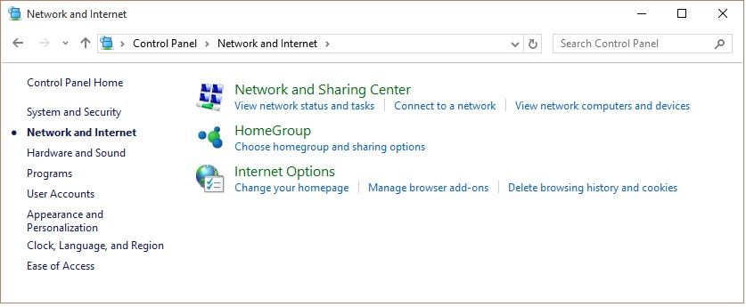
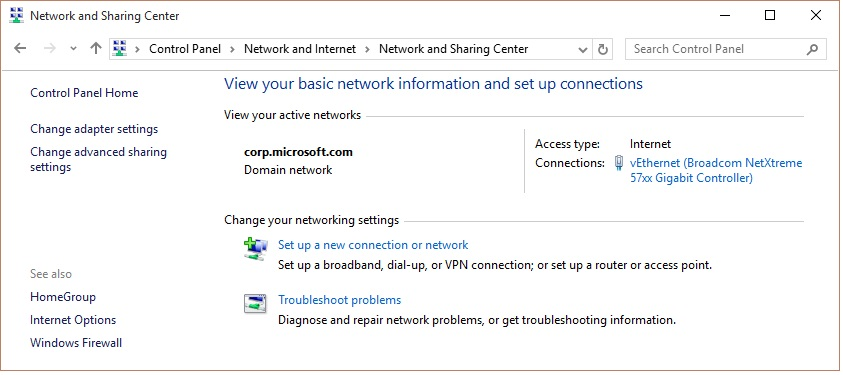
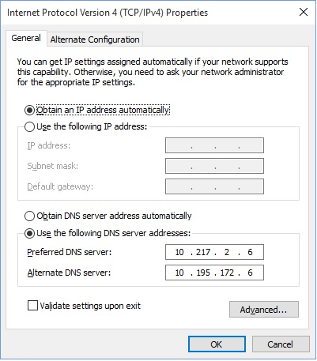
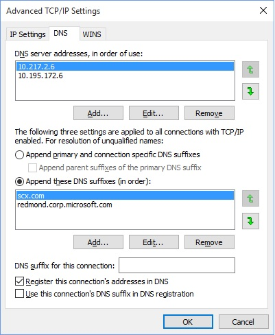

# UpdateDNS

### What is UpdateDNS?

UpdateDNS is a shell script designed for Linux systems that will keep your
TCP/IP address updated in a DNS server. It is most useful in virtutalization
environments where your TCP/IP address can change due to DHCP, but you want
to be able to reach it by name.

In certain environments (primarily with Microsoft DNS server), the DHCP
address lease does not trigger a DNS server update. This script fixes that
issue.

### Design

There are a number of ways that UpdateDNS can work. This is how it does work:

- Runs at bootup (after network starts up), verifying the host address,
- Runs every 15 minutes to verify the host address

Given this design, the average time that a host address will be "out of sync"
is 7.5 minutes. Note that TTL times on the DNS definition is short (300 secs),
which prevents the DNS cache from serving a stale address.

While we can integrate more deeply with the DHCP client (thus updating DNS
immediately after a new address is issued), this is different from system to
system and thus decreases portability.

Currently, UpdateDNS runs on virtually all Linux systems (Redhat, CentOS,
SuSE, Debian, Ubuntu). It may be ported to UNIX systems at a later date.

UpdateDNS also keeps it's log files trimmed via logrorate. This may be
changed to other mechanisms as necessary if the script is ported elsewhere.

### Setup

To use UpdateDNS, the host system must be modified to reference the DNS server
where updates are kept. This is hard-coded in the script, but can trivially be
changed if necessary. To modify the host Windows system to reference the DNS
server, this is done via the Control Panel:



Select Network and Internet:



Select Network and Sharing Center:



Select your network controller:


Click the "Properties" button:


Select "Internet Protocol Version 4 (TP/IP v4) and click "Properties" button:



Select "Use the following DNS server addresses:", enter 10.217.2.6, along with the backup DNS server 10.195.172.6 and click "Advanced":



Select the "DNS" tab, and set up DNS suffixes as shown above. Add these suffixes:

```
scx.com
redmond.corp.microsoft.com
```

Finally, click "OK" and/or "Close" to close each of the dialog boxes.
