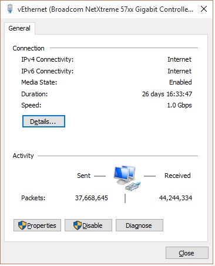
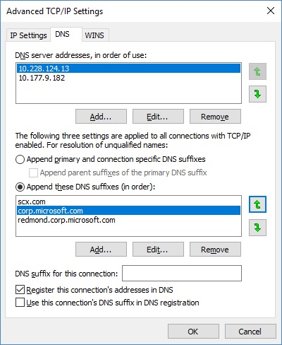

# UpdateDNS

### What is UpdateDNS?

UpdateDNS is a shell script designed for Linux systems that will keep your
TCP/IP address updated in a DNS server. It is most useful in virtutalization
environments where your TCP/IP address can change due to DHCP, but you want
to be able to reach it by name.

In certain environments (primarily with Microsoft DNS server), the DHCP
address lease does not trigger a DNS server update. This script fixes that
issue.

**IMPORTANT:** If you use this repository, please click the "Watch" button
at the top of this page so you know if the script has changed. Otherwise,
you'll have no way to be aware of changes to UpdateDNS.

### Design

There are a number of ways that UpdateDNS can work. This is how it does work:

- Runs at bootup (after network starts up), verifying the host address,
- Runs every 15 minutes to verify the host address

Given this design, the average time that a host address will be "out of sync"
is 7.5 minutes. Note that TTL times on the DNS definition is short (300 secs),
which prevents the DNS cache from serving a stale address.

While we can integrate more deeply with the DHCP client (thus updating DNS
immediately after a new address is issued), this is different from system to
system and thus decreases portability.

Currently, UpdateDNS runs on virtually all Linux systems (Redhat,
CentOS, SuSE, Debian, Ubuntu), as well as Mac OS/X. It may be ported
to UNIX systems at a later date.

UpdateDNS also keeps it's log files trimmed via logrorate. This may be
changed to other mechanisms as necessary if the script is ported elsewhere.

### Setup

To use this script on CentOS systems, you must install the `bind-util`
package. updatedns requires the *dig* program, which is part of the
bind-util package.

There are two steps to use this script:

1. The script should be installed on your Linux system. This can be done via
following steps:
  1. ```git clone https://github.com/jeffaco/msft-updatedns.git updatedns```
  2. ```cd updatedns; ./updatedns.sh --configure -v```

2. To use UpdateDNS, your development system must should modified to
reference the DNS server where updates are kept. This is hard-coded in
the script, but can trivially be changed if necessary.
Follow either of the below instructions to modify the host Windows system.

- [Modifying via Control Panel](#using-gui)
- [Modifying via PowerShell](#using-powershell)

#### Using GUI

Via the System Control Panel:


Select Network and Internet:


Select Network and Sharing Center:


Select your network controller:



Click the "Properties" button:


Select "Internet Protocol Version 4 (TP/IP v4) and click "Properties" button:


Select "Use the following DNS server addresses:", enter 10.228.124.13, along with the backup DNS server 10.177.9.182 and click "Advanced":



Select the "DNS" tab, and set up DNS suffixes as shown above. Add these suffixes:

```
scx.com
corp.microsoft.com
redmond.corp.microsoft.com
```

Finally, click "OK" and/or "Close" to close each of the dialog boxes.

#### Using PowerShell

To modify the host Windows system to reference the DNS server,
we can use PowerShell.

In an **Administrative** PowerShell session:

```powershell
Set-DnsClientServerAddress -InterfaceAlias Ethernet -ServerAddresses @("10.228.124.13","10.177.9.182")
Set-DnsClientGlobalSetting -SuffixSearchList @("scx.com","corp.microsoft.com","redmond.corp.microsoft.com")
```

Since `-InterfaceAlias Ethernet` is a guess, if it does not work,
you can instead use `-InterfaceIndex` and provide the appropriate IPv4 interface
by the index provided by `Get-DnsClientServerAddress`.

A more verbose example of setting the DNS addresses:

```powershell
# View your existing settings
> Get-DnsClientServerAddress

InterfaceAlias               Interface Address ServerAddresses
                             Index     Family
--------------               --------- ------- ---------------
Ethernet                             2 IPv4    {<other IP addresses>}
...

# Set the "Ethernet" interface's DNS addresses
> Set-DnsClientServerAddress -ServerAddresses @("10.228.124.13","10.177.9.182") -InterfaceAlias Ethernet

# Verify the changes
> Get-DnsClientServerAddress

InterfaceAlias               Interface Address ServerAddresses
                             Index     Family
--------------               --------- ------- ---------------
Ethernet                             2 IPv4    {10.228.124.13, 10.177.9.182}
...

```

A more verbose example of setting the DNS search suffixes:


```powershell
# View your existing settings
> Get-DnsClientGlobalSetting

UseSuffixSearchList : True
SuffixSearchList    : {}
UseDevolution       : True
DevolutionLevel     : 0


# Set the global DNS suffix search list
> Set-DnsClientGlobalSetting -SuffixSearchList @("scx.com","redmond.corp.microsoft.com","ntdev.corp.microsoft.com")

# Verify the changes
> Get-DnsClientGlobalSetting

UseSuffixSearchList : True
SuffixSearchList    : {scx.com, redmond.corp.microsoft.com, ntdev.corp.microsoft.com}
UseDevolution       : True
DevolutionLevel     : 0

```

The host Windows DNS settings should now be set.
You can *alternatively* use the Control Panel instead of PowerShell;
to do so, follow the below instructions *instead* of the above.
